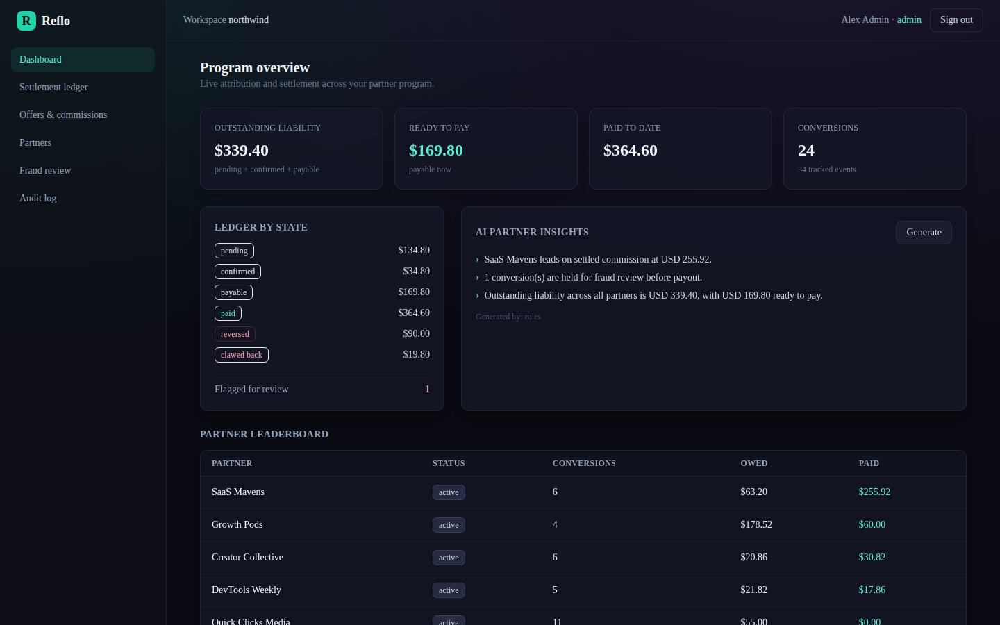
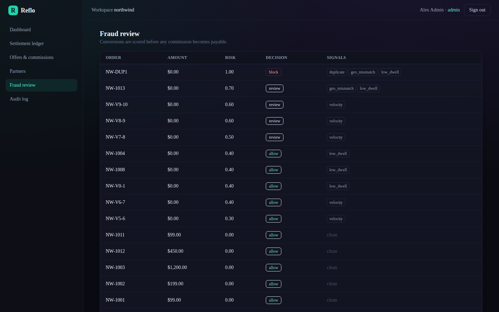
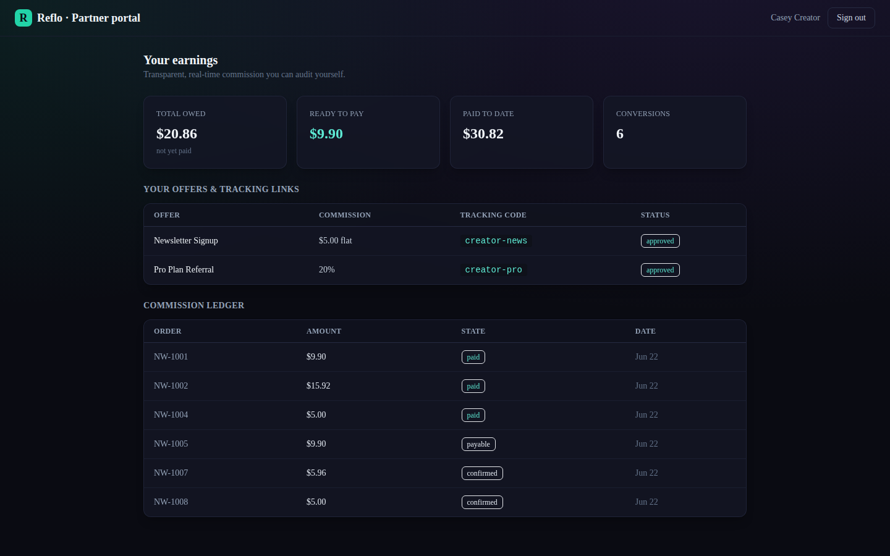
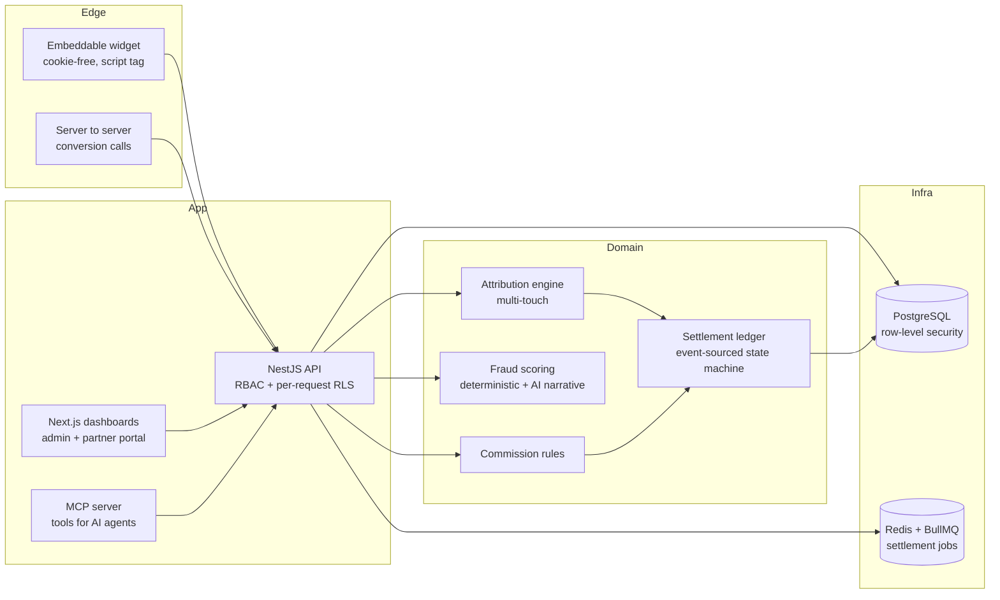

<div align="center">

# Reflo

**Self-hostable, developer-first partner attribution and settlement.**

[](LICENSE)
[](packages/domain)
[](#architecture)

</div>

Reflo is an affiliate and partner program you actually own. It tracks partner referrals with first-party, cookie-free attribution, splits commission across the whole customer journey instead of guessing at the last click, and records every cent of payout in an append-only ledger you can audit line by line. It runs on your own infrastructure with one command, ships a real AI fraud layer that holds suspicious conversions before they get paid, and exposes the entire program to AI agents through a Model Context Protocol server. No black box, no payout lock-in, no third-party cookie to lose.

<div align="center">

</div>

---

## Why Reflo

Partner platforms like PartnerStack, Impact and Everflow work, but teams keep hitting the same walls: your program data lives in someone else's database, payouts move through a settlement layer you cannot inspect, attribution leans on third-party cookies that browsers are killing, and pulling any of it into your own tooling means fighting a closed API. Reflo is built around the parts those products are weakest on.

| | Typical SaaS platforms | Reflo |
|---|---|---|
| **Hosting & data** | Vendor cloud, your data in their database | Self-hosted, your Postgres, full export |
| **Attribution** | Cookie and last-click leaning | First-party server-to-server, multi-touch |
| **Settlement** | Opaque payout engine | Event-sourced ledger you can replay and audit |
| **Fraud** | Add-on or manual | Built-in scoring that gates payout before it accrues |
| **Extensibility** | Closed API, no agent access | Open HTTP API plus an MCP server for AI agents |
| **Cost model** | Percentage of payout volume | Open source, run it yourself |

This is a working product seed, not a slide. Everything below is in the repository and runs.

---

## What it does

**Phase 1, the core program**
- Multi-tenant Postgres with row-level security, so one database isolates many programs at the database layer, not just in app code.
- Offer catalog, partner and customer management, and data-driven commission rules (percentage, flat, tiered, recurring).
- An embeddable, cookie-free tracking widget (one script tag) that records clicks and lead submissions, authenticated by a public key and an allowed-domain list.
- A first-party, server-to-server attribution engine with five models (last touch, first touch, linear, position based, time decay).
- An append-only settlement ledger with an explicit state machine (pending, confirmed, payable, paid, plus reversal and clawback) and a full audit log.
- Role-based access control across owner, admin, analyst and partner roles.
- An admin dashboard and a partner portal built with Next.js and Tailwind.

**Phase 2, the differentiators**
- An AI fraud and anomaly detector that scores every conversion (velocity, duplicate, geo mismatch, low dwell) and holds or blocks it before commission accrues.
- AI partner-performance insights that work with or without a model key.
- A Model Context Protocol server that exposes tracking, attribution, ledger and reporting as tools, so an agent can run a program.

<table>
<tr>
<td width="50%"></td>
<td width="50%"></td>
</tr>
<tr>
<td align="center"><sub>Fraud review queue, scored before payout</sub></td>
<td align="center"><sub>Partner portal, scoped to one partner by RLS</sub></td>
</tr>
</table>

---

## Quickstart

You need Docker and Docker Compose. From the repository root:

```bash
docker compose up --build
```

That single command brings up Postgres, Redis, the API and the dashboards, runs the migrations, and seeds a complete demo program. Give it a minute, then open:

- Admin dashboard and partner portal: http://localhost:3000
- API: http://localhost:4000 (health at `/health`)

Sign in with any of the seeded demo logins (password `demo1234`):

| Role | Email | Sees |
|------|-------|------|
| Admin | `admin@northwind.test` | Full program: ledger, offers, partners, fraud, audit |
| Analyst | `analyst@northwind.test` | Read-only reporting |
| Partner | `partner@northwind.test` | Only their own earnings, ledger and links |

The seeded program already contains partners, offers, a month of conversions across every attribution model, a fraud ring that gets caught, and ledger entries in every state, so a reviewer sees the whole thing working in under a minute.

---

## Architecture



The money-critical logic (ledger, attribution, commission, fraud scoring) lives in a pure, framework-free package with no I/O, covered by unit tests that assert exact-cent correctness. The API binds every request to a tenant inside a transaction and lets Postgres enforce isolation. See [ARCHITECTURE.md](ARCHITECTURE.md) for the full picture and [docs/ERD.md](docs/ERD.md) for the data model.

---

## How the hard parts work

**Attribution is multi-touch and exact.** A conversion's commission is a single pool computed from the offer's rule, then split across every partner that touched the customer inside the lookback window. The split uses the largest-remainder method on integer cents, so fractional credit never creates or loses a penny. Switch models per conversion: a brand-awareness program might use first touch, a closer-heavy one time decay.

**The ledger is event-sourced.** Nothing about a commission is mutated in place. Each change (accrued, confirmed, marked payable, paid, reversed, clawed back) is an append-only event, and the current state is a fold over that stream. The database grants the event tables INSERT and SELECT only, so immutability holds at the privilege level, not by convention. Illegal transitions (paying a pending entry, clawing back before payout) are rejected by the same state machine the tests cover.

**Fraud gates payout, deterministically.** Every conversion is scored on velocity, duplicates, geo mismatch and click-to-convert dwell. The score and decision come from explicit thresholds, so they are reproducible and every flag lists the signals that fired. A blocked conversion never accrues commission. An optional model layer adds a plain-language narrative on top, but the payout decision never depends on it.

---

## The tracking widget

Drop one script tag on any partner page. It stores a first-party identity in localStorage, with no third-party cookie, and the server validates the calling domain against the key's allowlist.

```html
<script src="http://localhost:4000/reflo.js"
        data-reflo-key="pk_live_pro_8f2a"
        data-reflo-api="http://localhost:4000"
        data-reflo-partner="creator-pro"
        data-reflo-auto="true"></script>
```

A live example is in [packages/widget/demo.html](packages/widget/demo.html). Conversions are confirmed server to server, so they survive ad blockers and cookie loss.

---

## AI agents (MCP)

The MCP server in [apps/mcp](apps/mcp) exposes the program as tools an agent can call: program summary, partner leaderboard, ledger entries, fraud assessments, partner insights, recording a conversion, advancing a ledger entry, and running payouts. It talks to the same HTTP API the dashboard uses, so it inherits RBAC, row-level security and the audit log.

The AI layer is provider-agnostic. It reads an optional `config.json` (chmod 600, never committed, never an environment variable) for an OpenAI-compatible endpoint, defaulting to a free NVIDIA NIM model. Without a key, the insights and fraud narratives fall back to deterministic, rule-based output, so the platform is fully functional with zero secrets. Copy `config.example.json` to `config.json` to add a key.

---

## Tests

The money math is unit-tested in the domain package:

```bash
npm install
npm run test:domain
```

```
Test Files  5 passed (5)
     Tests  46 passed (46)
```

These cover exact-cent allocation, conserved ledger balances, legal-only state transitions, every attribution model summing to one, commission rounding across rule types, and fraud signal stacking.

---

## Project layout

```
reflo/
  packages/
    domain/      Pure, tested money logic: ledger, attribution, commission, fraud
    widget/      The embeddable cookie-free tracking script
  apps/
    api/         NestJS API: ingest, pipeline, ledger, RBAC, audit, reports
    web/         Next.js admin dashboard and partner portal
    mcp/         Model Context Protocol server for AI agents
  db/
    migrations/  Schema and row-level-security policies
  docs/          Architecture, ERD, screenshots
```

---

## License

Apache-2.0. See [LICENSE](LICENSE).
