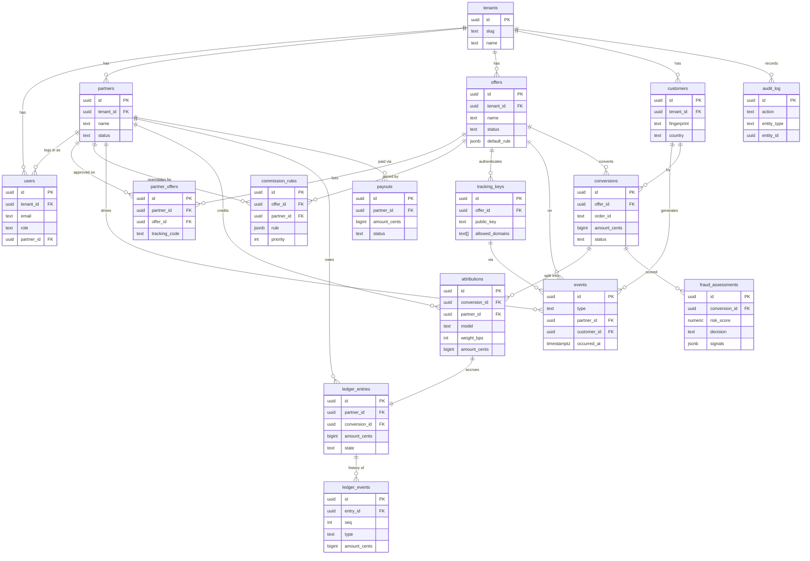

# Entity-relationship diagram

Every table except `tenants` carries a `tenant_id` and is guarded by row-level security. The append-only tables are `events`, `ledger_events` and `audit_log`.

```mermaid
erDiagram
  tenants ||--o{ users : has
  tenants ||--o{ partners : has
  tenants ||--o{ offers : has
  tenants ||--o{ customers : has

  partners ||--o{ users : "logs in as"
  partners ||--o{ partner_offers : "approved on"
  offers   ||--o{ partner_offers : lists
  offers   ||--o{ commission_rules : "priced by"
  partners ||--o{ commission_rules : "overridden for"
  offers   ||--o{ tracking_keys : authenticates

  customers ||--o{ events : generates
  partners  ||--o{ events : drives
  offers    ||--o{ events : on
  tracking_keys ||--o{ events : via

  offers    ||--o{ conversions : converts
  customers ||--o{ conversions : by
  conversions ||--o{ attributions : "split into"
  partners    ||--o{ attributions : credits
  conversions ||--o{ fraud_assessments : scored

  attributions ||--|| ledger_entries : accrues
  partners     ||--o{ ledger_entries : owes
  ledger_entries ||--o{ ledger_events : "history of"
  partners     ||--o{ payouts : "paid via"

  tenants ||--o{ audit_log : records

  tenants {
    uuid id PK
    text slug
    text name
  }
  users {
    uuid id PK
    uuid tenant_id FK
    text email
    text role
    uuid partner_id FK
  }
  partners {
    uuid id PK
    uuid tenant_id FK
    text name
    text status
  }
  offers {
    uuid id PK
    uuid tenant_id FK
    text name
    text status
    jsonb default_rule
  }
  commission_rules {
    uuid id PK
    uuid offer_id FK
    uuid partner_id FK
    jsonb rule
    int priority
  }
  partner_offers {
    uuid id PK
    uuid partner_id FK
    uuid offer_id FK
    text tracking_code
  }
  tracking_keys {
    uuid id PK
    uuid offer_id FK
    text public_key
    text[] allowed_domains
  }
  customers {
    uuid id PK
    uuid tenant_id FK
    text fingerprint
    text country
  }
  events {
    uuid id PK
    text type
    uuid partner_id FK
    uuid customer_id FK
    timestamptz occurred_at
  }
  conversions {
    uuid id PK
    uuid offer_id FK
    text order_id
    bigint amount_cents
    text status
  }
  attributions {
    uuid id PK
    uuid conversion_id FK
    uuid partner_id FK
    text model
    int weight_bps
    bigint amount_cents
  }
  ledger_entries {
    uuid id PK
    uuid partner_id FK
    uuid conversion_id FK
    bigint amount_cents
    text state
  }
  ledger_events {
    uuid id PK
    uuid entry_id FK
    int seq
    text type
    bigint amount_cents
  }
  fraud_assessments {
    uuid id PK
    uuid conversion_id FK
    numeric risk_score
    text decision
    jsonb signals
  }
  payouts {
    uuid id PK
    uuid partner_id FK
    bigint amount_cents
    text status
  }
  audit_log {
    uuid id PK
    text action
    text entity_type
    uuid entity_id
  }
```
